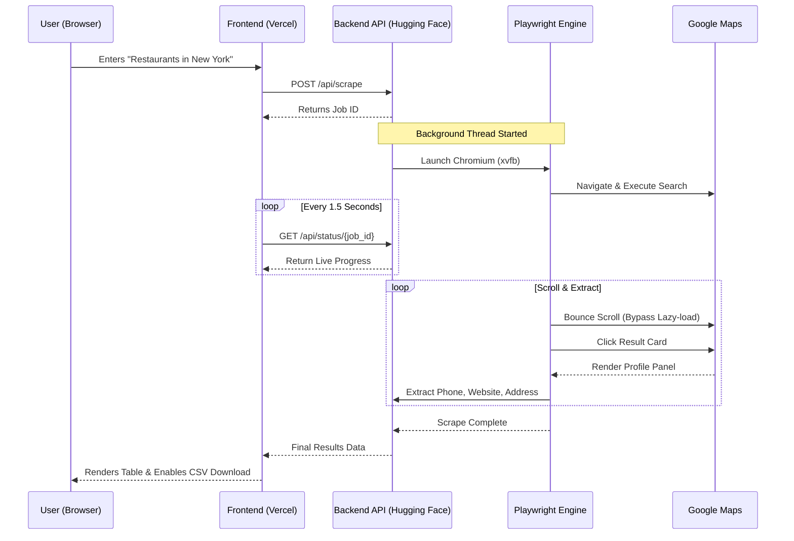

# 🚀 Google Maps Business Scraper & Tracker


A state-of-the-art, anti-bot resistant Google Maps scraping application. This tool allows you to search for local businesses (like "Restaurants in Vadodara") and instantly extract highly detailed lead data including **Names, Phones, Addresses, Websites, Reviews, Ratings, Categories, and Google Maps Profile links**.

---

## ✨ Features
* **Anti-Bot Evasion:** Uses a simulated human-like scrolling mechanism and `headless=False` (with `xvfb` in Docker) to completely bypass Google Maps' strict bot detections.
* **Lightning Fast Extraction:** Optimized asynchronous Playwright tasks capable of scraping 100+ business details in under 2 minutes.
* **Real-time Web UI:** Beautiful, dark-glassmorphism frontend that updates asynchronously to show you live scraping progress.
* **One-Click Export:** Instantly download all generated leads into a clean, formatted `.csv` file.
* **Full-Stack Separation:** Built to be hosted across edge networks (Frontend on Vercel, Backend on Hugging Face Spaces).

---

## 🏗️ Architecture & Workflow

Here is how the application orchestrates the scraping job from the moment a user hits "Start Scraping":



### Infrastructure Deployment Graph

```mermaid
graph TD
    subgraph Client
        Browser[User Browser]
    end

    subgraph Vercel [Vercel (Frontend)]
        HTML[index.html]
        JS[script.js]
        CSS[style.css]
    end

    subgraph HF [Hugging Face Spaces (Backend)]
        FastAPI[FastAPI Server]
        Playwright[Playwright Browsers]
        XVFB[Xvfb Virtual Display]
    end

    Browser -->|Serves UI| HTML
    HTML -->|AJAX Fetch Requests| FastAPI
    FastAPI -->|Controls| Playwright
    Playwright -->|Renders via| XVFB
    Playwright -->|Scrapes| GoogleMaps((Google Maps))
```

---

## 💻 Local Installation (Windows)

1. Clone this repository to your local machine.
2. Ensure you have Python installed.
3. Simply double-click the `start.bat` file! 

The batch script will automatically:
- Install all necessary `pip` dependencies.
- Download the Playwright Chromium binaries.
- Launch the FastAPI server.
- Tell you to open `http://localhost:8000` in your browser.

---

## ☁️ Production Deployment

### 1. Deploy the Backend to Hugging Face Spaces
1. Create a new **Docker** Space on Hugging Face.
2. Upload the Backend files: `Dockerfile`, `requirements.txt`, `server.py`, and `scraper.py`.
3. Hugging Face will automatically read the `Dockerfile`, install `xvfb`, and start the Uvicorn server on port `7860`.
4. Copy the direct URL of your Space.

### 2. Connect the Frontend
1. Open `frontend/script.js`.
2. Modify the `API_BASE` variable to point to your new Hugging Face Space:
   ```javascript
   const API_BASE = 'https://<your-username>-<your-spacename>.hf.space/api';
   ```

### 3. Deploy Frontend to Vercel
1. Connect this GitHub repository to Vercel.
2. Set the **Root Directory** to `frontend`.
3. Deploy! Vercel will host your static files globally, and they will securely route data to your Hugging Face API.

---

## ⚠️ Disclaimer
This tool was built for educational purposes to demonstrate advanced browser automation, concurrent background task handling in FastAPI, and Dockerized virtual displays. Scraping Google Maps may violate Google's Terms of Service. Use responsibly.
